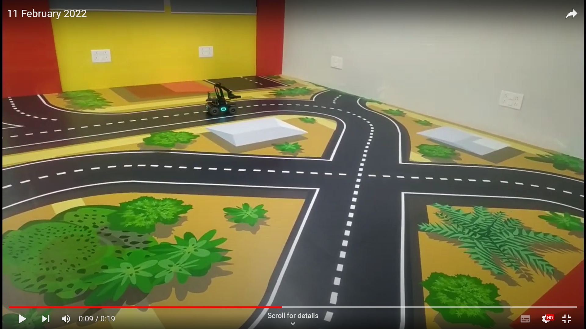

# MobileRobot-Openloopcontrol
## Aim:

To develop a python control code to move the mobilerobot along the predefined path.

## Equipments Required:
1. RoboMaster EP core
2. Python 3.7

## Procedure

### Step 1:
Use from robomaster import robot

### Step 2:
Choose the x,y,z - axis movement distance(meters).

### Step 3:
Give ep_chassis.move to move straight.

### Step 4:
Give time.sleep() for a break.

### Step 5:
Give ep_chassis.drive_speed to have a circular movement.
## Program
python
~~~
from robomaster import robot
import time

if __name__ == '__main__':
    ep_robot = robot.Robot()
    ep_robot.initialize(conn_type="ap")

    ep_chassis = ep_robot.chassis

    ## Write your code here
    '''
    x = x-axis movement distance,( meters) [-5,5]
    y = y-axis movement distance,( meters) [-5,5]
    z = rotation about z axis ( degree)[-180,180]
    xy_speed = xy axis movement speed,( unit meter/second) [0.5,2]
    '''
   
    ep_chassis.move(x=0.9, y=0, z=0, xy_speed=0.75).wait_for_completed()

    ep_chassis.drive_speed(x=0.05, y=0, z=-15)
    time.sleep(5)
    ep_chassis.move(x=1.9, y=0, z=0, xy_speed=0.75).wait_for_completed()
    ep_chassis.drive_speed(x=0.20, y=0, z=5)
    ep_chassis.drive_speed(x=0.25, y=0, z=20)
    ep_chassis.move(x=0.9, y=0, z=0, xy_speed=0.75).wait_for_completed()
    ep_chassis.drive_speed(x=0.20, y=0, z=21)
    time.sleep(5)
    ep_chassis.drive_speed(x=1, y=0, z=5)
    ep_robot.close()
~~~
## MobileRobot Movement Image:

Insert image here

 
 
 
 

## MobileRobot Movement Video:

Upload your video in Youtube and paste your video-id here

https://youtu.be/MqReMNWSRUw

## Result:
Thus the python program code is developed to move the mobilerobot in the predefined path.

Mobile Robotics Laboratory
 
Department of Artificial Intelligence and Data Science/ Machine Learning
 
Saveetha Engineering College

